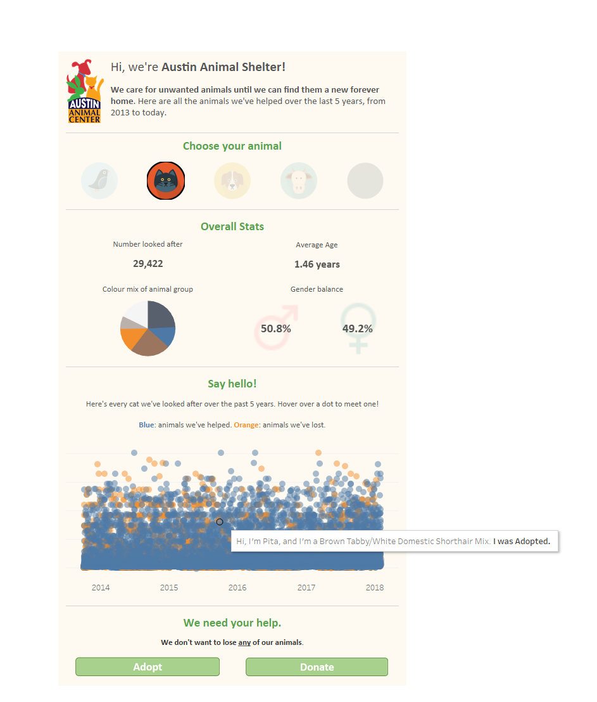

# Austin Animal Center Data

_Note: This is my sample data analytics project; feedback would be appreciated._
_The Dashboard sample is at the end._

Undoubtedly, Austin is doing its best to provide a temporary home for the animals, with only 8% of all intakes from 2013 to 2024 returning back to the shelter. It has taken into the shelter 145.147 animals (75663 dogs, 60226 cats, 812 birds, 27 livestock such as pigs, goats, etc, and 8419 other types of animals). 

I want to investigate the following:
1. What is the % of animals that return to the shelter?
2. What is the average and median time from the first and second intake, if there is one?
3. What type of animal returns most to the shelter?
4. What is the reason for the return?

## Database Design

### Table: animal_intakes

The animal_intakes table is designed to store detailed records of all animals brought into the shelter. Below is an outline of the table structure and the rationale behind the design choices

| Column Name      | Data Type                   | Description                                                      |
|------------------|-----------------------------|------------------------------------------------------------------|
| `intake_id`      | SERIAL (Primary Key)        | Auto-incrementing identifier for each record.                    |
| `animal_id`      | TEXT                        | Non-unique identifier assigned to each animal.                   |
| `name`           | TEXT                        | Name of the animal, if provided.                                 |
| `datetime`       | TIMESTAMP WITHOUT TIME ZONE | Date and time when the animal was brought into the shelter.      |
| `intake_type`    | TEXT                        | Intake category (e.g., stray, surrendered).                   |
| `intake_condition` | TEXT                      | Condition of the animal upon arrival (e.g., healthy, injured).   |
| `animal_type`    | varchar(10)                 | Type of animal (e.g., dog, cat).                                 |
| `sex_upon_intake` | TEXT                       | Sex and reproductive status of the animal at intake.             |
| `age_value`      | SMALLINT                    | Numeric value representing the animal's age.                |
| `age_unit`       | VARCHAR(10)                 | Unit of measurement for the age (e.g., years, months, weeks).    |
| `breed`          | TEXT                        | Breed of the animal, if known.                                   |
| `color`          | TEXT                        | Color of the animal's fur, feathers, etc.                        |


**Design Rationale**

- `intake_id`: This unique identifier for each intake event ensures that each record is distinctly accessible and manageable.
- `animal_id`: While this ID is unique to each animal, it is not unique to each intake event, as animals may be brought to the shelter more than once.
`age_value` and `age_unit`:
- Splitting the `age_upon_intake` into numeric (`age_value`) and textual (`age_unit`) components allows for more straightforward and efficient numerical analyses and queries.
    - `age_value` uses SMALLINT to efficiently store the age numerically while ensuring the data fits within the typical range of animal ages.
    - `age_unit` is defined as VARCHAR(10) to optimize storage and enforce consistency in the units of measurement.
- I remove the `Monthyear` column because I can extract it from the `datetime` column. I also removed `found_location` because I don't need the exact location for my analysis.


### STEPS
#### STEP 1: Import the CSV file into SQL
I have already created the table `animal_intakes`, so I import the CSV file with the below query.

```sql

COPY animal_intakes (
	Animal_id, 
	Name, 
	DateTime,
	Intake_Type,
	Intake_Condition,
	Animal_Type,
	Sex_upon_Intake,
	Age_upon_Intake,
	Breed,
	Color)
FROM 'filepath'
WITH (FORMAT CSV,HEADER);
```
#### STEP 2: Populate age_value and age_unit

To populate the `age_value` and `age_unit`, I need to split the `age_upon_intake`. Since `age_upon_intake` is a text and `age_valu`e is stored as smallint, I need to cast the `split_part` as an integer.

```sql
UPDATE animal_intakes
SET age_value = CAST(SPLIT_PART(age_upon_intake, ' ', 1) AS INTEGER),
    age_unit = SPLIT_PART(age_upon_intake, ' ', 2);
```

#### STEP 3: Standardizing the age_unit
Since I want to check the average and median age of animals in the shelter, I need to standardize the age in one unit. Looking for the average and median now, as they are, will give me the numbers 3.37 and 2, respectively, but I don't know if it is in days, weeks, months, or years. Running a `SELECT DISTINCT(age_unit)` query, I saw that the age units are day, days, month, months, week, weeks, year, years, and null (only 1), which I chose to delete because it had a lot of nulls and the name was Test. 

```sql
UPDATE animal_intakes
SET age_unit = CASE
    WHEN age_unit IN ('day', 'days') THEN 'days'
    WHEN age_unit IN ('week', 'weeks') THEN 'weeks'
    WHEN age_unit IN ('month', 'months') THEN 'months'
    WHEN age_unit IN ('year', 'years') THEN 'years'
    ELSE age_unit
END;
```


#### STEP 4: Handling Data Anomalies: Negative Age Values

After populating the `age_value` and `age_unit`, I selected (with `distinct`) the columns and identified records in the `animal_intakes` table with negative age values. Given that negative ages are not feasible and because there are only 13 rows, I assumed that the real age is the number and I decided to keep the rows but update the table with their absolute values.


  ```sql
  UPDATE animal_intakes
  SET age_value = ABS(age_value) -- abs = absolute value
  WHERE age_value < 0;
```

#### STEP 5: Checking the null %
I used the formula below to calculate the % of nulls for each column. 
```sql
select 
(100.0 - count(column)*100.0/count(*)) as null_percentage
from animal_intakes
;
```
The only column that had nulls was the `name` column, but I decided not to delete anything from it. The `sex_upon_intake` column had 0.0006% nulls, so there were only 1, but I also decided **not** to delete it because the rest of the columns were filled.

#### STEP 6: No of animals

```sql
select animal_type, count(*)
from animal_intakes
group by animal_type
order by count desc
;
```
Results:

|Animal Type | Unique_Animal_count|
-------------|--------------------|
|    Dog     |	      89352       |
|    Cat     |	      63063       |
|    Other   |	       8457       |
|    Bird    |	        812       |
|  Livestock |	         27       |


Sum = 161.711

This number 161.711 represents the animal intakes in the shelter. It counts both distinct and `animal_ids` that appear more than once. 

To count the actual number of dogs,cats, etc., in the shelter, considering that some have returned, we need to count the ones with distinct animal IDs to make sure we don't count more than once the same animal. This method will give us a clearer picture of how many different animals we have dealt with.

```sql
select animal_type, count(distinct(animal_id)) as unique_animal_count
from animal_intakes
group by animal_type
order by unique_animal_count desc
;
```
Results:

|Animal Type | Unique_Animal_count|
-------------|--------------------|
|    Dog     |	      75663       |
|    Cat     |	      60226       |
|    Other   |	       8419       |
|    Bird    |	        812       |
|  Livestock |	         27       |

Sum = 145.147

It is imporant to understand the different insights that these numbers provide. The animal shelter has cared 145.147 but operationally speaking it's like it cared for 161.711 (about 1.2 times more).

#### STEP 6: INVESTIGATE THE QUESTIONS

**1. % of animal IDs that appear more than once in the dataset**

Here, we can see this from two different viewpoints, the operational and the actual: 

Operational Viewpoint:
To find this percentage, I need:
 
- the total number of rows with `animal_id` that appear more than once, and
- the total number of `animal_id` (duplicates or not)
divide them * 100.

(total number of rows with animal ids that appear more than once / total number of animal id (duplicates or not) ) * 100

_**The total number of rows with animal IDs that appear more than once is:**_

```sql
select sum(count)as total_duplicates
from 
(select
animal_id, count(*) as count
from animal_intakes
group by animal_id
having count(*) > 1
) as id_duplicates
;
```
_**The total number of animal IDs is:**_

```sql
select count(animal_id)
from animal_intakes
;
```

So:
```sql
select (
select sum(count)as total_duplicates
from 
(select
animal_id, count(*) as count
from animal_intakes
group by animal_id
having count(*) > 1
) as id_duplicates)
/
(select count(animal_id)
from animal_intakes
	) *100 as duplicate_percentage
;
```
<<percentage photo>>

The percentage of 18.09% indicates that 18.09% of the total entries in the `animal_intakes` database represent instances where the animal_id appears more than once. This suggests that about 18% of the entries are for animals admitted to the shelter more than once. So, operationally the shelter works as if 18% of animals returning back with some of them. 

```sql
select a.*
from animal_intakes a
inner join(
select animal_id
from animal_intakes
group by animal_id
having count(*) >1
) as duplicates on a.animal_id = duplicates.animal_id
order by animal_id,datetime;
```

Here we can see that 29261 entries out of the 161711 (18.09%) appear more than once.

Actual:

```sql
SELECT COUNT(*) AS number_of_animals
FROM (
    SELECT animal_id
    FROM animal_intakes
    GROUP BY animal_id
    HAVING COUNT(*) > 1
) AS RepeatVisitors
;
```
Result:

| number_of_animals |
|-------------------| 
|      12697        |


The 12.697 is the actual number of distinct animals that come to the shelter more than once. That would make it 8% of the actual total number of distinct animals (145.147) come back to the shelter more than once. Let's get a closer look tose 2 percentages:

- 8% of the animals that come to the shelter, come back. 
- But 18.09% of all intakes are with animals that their animal_id appear more than once. That means, that if each entry (and not animal as it is now) had a unique animal_id, then it would be like 18.09% is the percentage of animals returning back to the shelter. So operationally, it functions as if 18% are returning. The % is higher than the 8 because there are some animals that came a lot of times with the highest being 33 times.

**More specifically:**
**Frequency of returns**

```sql
WITH ReturnCounts AS (
    SELECT animal_id, COUNT(*) AS times_returned
    FROM animal_intakes
    GROUP BY animal_id
    HAVING COUNT(*) > 1 
)
SELECT times_returned, COUNT(animal_id) AS number_of_animals
FROM ReturnCounts
GROUP BY times_returned
ORDER BY times_returned
;
```
Results:

|Times_returned| Number_of_animals|
-------------|--------------------|
|    2       |	      10084       |
|    3       |         1860       |
|    4       |          501       |	
|    5       |          138       |
|    6       |	         52       |
|    7       |	         37       |	
|    8       |	         14       |
|    9       |	          5       |
|    10      |	          1       |	
|    11      |	          2       |	
|    12      |	          1       |
|    14      |	          1       |
|    33      |	          1       |	


2. Average and Median Time Between Entries for Returning Animals
```sql
WITH TimeDifferences AS (
    SELECT 
        animal_id, 
        datetime,
        LAG(datetime) OVER (PARTITION BY animal_id ORDER BY datetime) AS previous_datetime,
        EXTRACT(DAY FROM (datetime - LAG(datetime) OVER (PARTITION BY animal_id ORDER BY datetime))) AS days_between_visits
    FROM 
        animal_intakes
)
SELECT 
    AVG(days_between_visits) AS average_days_between_visits,
    PERCENTILE_CONT(0.5) WITHIN GROUP (ORDER BY days_between_visits) AS median_days_between_visits
FROM 
    TimeDifferences
WHERE 
    days_between_visits IS NOT NULL;
```

The large difference between the average and median suggests that the data is right-skewed, meaning a few animals with very long intervals between shelter visits are increasing the average. These could be outliers or specific cases where they had long periods of successful adoption before returning - we could understand this more by using the animal_outcomes dataset.
- The significantly lower median suggests that more than half of the animals return within about 97 days, so around 3 months. That means that from the first intake in the shelter, within a 3-month period, the animal will return to the shelter. 


3. Most Common Animal Type Among Returnees

```sql
WITH Returnees AS (
    SELECT animal_id
    FROM animal_intakes
    GROUP BY animal_id
    HAVING COUNT(*) > 1
)
SELECT animal_type, COUNT(DISTINCT animal_id) AS returnee_count
FROM animal_intakes
WHERE animal_id IN (SELECT animal_id FROM Returnees)
GROUP BY animal_type
ORDER BY returnee_count DESC;	
```	
Results:

|Animal Type | Unique_Animal_count|
-------------|--------------------|
|    Dog     |	      10107       |
|    Cat     |	       2553       |
|    Other   |	         37       |	

Sum = 12.697 


4. Frequency of different intake types among animals that have been admitted more than once:

```sql
SELECT intake_type, COUNT(*) AS count
FROM animal_intakes
WHERE animal_id IN (
	SELECT animal_id 
	FROM animal_intakes 
	GROUP BY animal_id 
	HAVING COUNT(*) > 1
)
GROUP BY intake_type
ORDER BY count DESC;
```
Results:

|Intake Type | Count              |
-------------|--------------------|
|    Stray   |	      15486       |
|  Owner Surrender   |	    10902 |
|  Public Assist   |	 2675     |
|    Abandoned   |  167           |
|  Euthanasia Request  |21       |
|  Wildlife   |	       10       |

That means that the top three common reasons for returns are because they are found as strays, the owners bring them back, or due to public assist.

4. Average & Median for the age

 - Calculating Average and Median Age of Animals with distinct IDs at First Intake

This calculation considers only the first intake of each unique animal, which provides a clearer picture of the ages at which animals first enter the shelter. It excludes those animals who are brought in multiple times. The calculation is in months.

```sql
WITH FirstIntakes AS (
    SELECT animal_id, MIN(datetime) AS first_intake_time
    FROM animal_intakes
    GROUP BY animal_id
)
SELECT 
    AVG(ai.age_value) AS average_age,
    PERCENTILE_CONT(0.5) WITHIN GROUP (ORDER BY ai.age_value) AS median_age
FROM animal_intakes ai
JOIN FirstIntakes fi ON ai.animal_id = fi.animal_id AND ai.datetime = fi.first_intake_time
;
```
Results:

|Average Age |    Median Age      |
-------------|--------------------|
|    22.2    |	      12          |

That means that the average age of animals entering the shelter for the first time is 22.2 months, and the median is 12 months, which means that some older animals skew the distribution to the right.

- Calculating average and median for all animals entering the shelter


```sql
SELECT 
    AVG(age_value) AS average_age,
    PERCENTILE_CONT(0.5) WITHIN GROUP (ORDER BY age_value) AS median_age
FROM animal_intakes;
```
|Average Age |    Median Age      |
-------------|--------------------|
|    23.58    |	      12          |


Comparing these 2 results shows that the average age for all animals entering the shelter (including those who re-enter) is higher, which makes sense since they are older when they re-enter. Also, we see that the difference is not that high probably because only 8% of the animals return to the shelter.
We can also see that the median stays the same in both approaches, which indicates a consistent central tendency in the age distribution of animals entering the shelter. This can be significant for the Austin shelter, as they know they can usually expect younger animals. 


